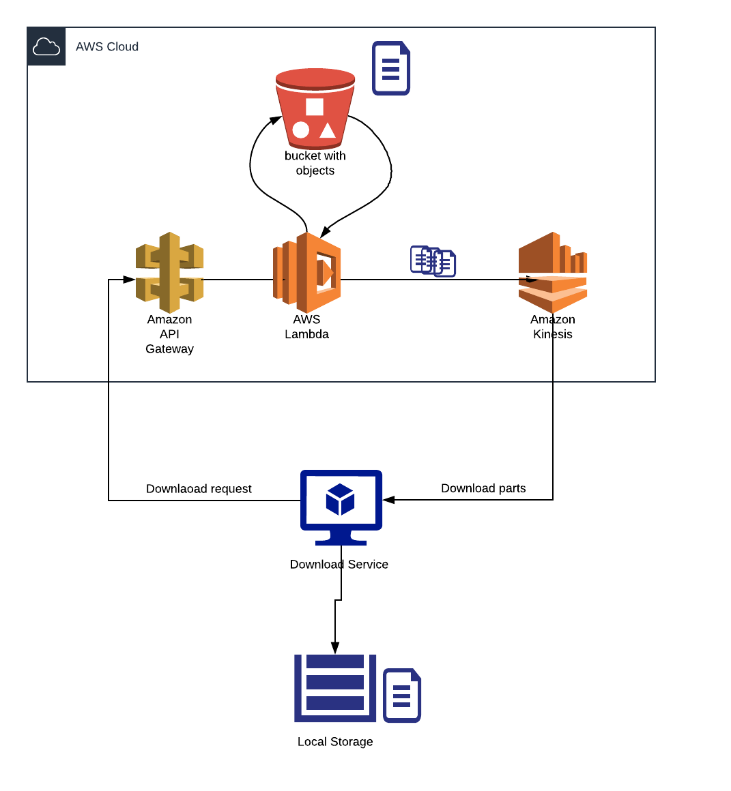
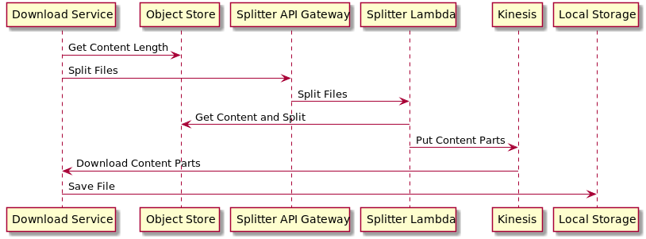

# Cloud File Downloader

## Motivation

* Transfer prices are high when downloading from object stores like AWS S3
* A single Gb costs 0.09$
* Kinesis streams don’t have egress costs
* A kinesis stream can produce 1Mb/shard/s
* That costs 0.017$ per hour which gives 3.6Gb/h (0.408$ per day)
* This means we can save up to 7.368$ per day per shard 

## Local setup:

In the name of cost saving, local development can be done without using any external services!!!

Install [docker](https://docs.docker.com/install/linux/docker-ce/ubuntu/) and [compose](https://linuxize.com/post/how-to-install-and-use-docker-compose-on-ubuntu-18-04/) 

Install [SAM Cli](https://docs.aws.amazon.com/serverless-application-model/latest/developerguide/serverless-sam-cli-install.html) from AWS.

Boot up s3 and kinesis (local) via `docker-compose up -d`

Start SAM local api gateway

`cd file-splitter && sam local start-api -p 5454 --docker-network cloud-fun_cloud`

Start the downloader service via idea

Run `./setup.sh`

curl http://127.0.0.1:8081/download/testbig.json
